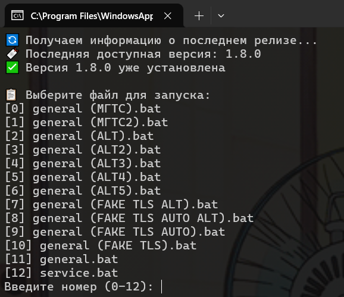
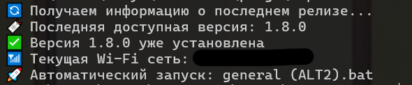

# 📶 zapret-wifi

Набор PowerShell-скриптов для управления zapret (из проекта [zapret-discord-youtube](https://github.com/Flowseal/zapret-discord-youtube)) в зависимости от текущей Wi-Fi сети. Удобно для автоматического запуска подходящей стратегии при переключении между сетями с разным уровнем цензуры. Также имеет функцию автообновления

--- 

## ⚙️ Использование

### Ручной запуск стратегии
```powershell
.\zapret-run.ps1
```
- Скачивает или обновляет zapret
- Предоставляет выбор стратегии \

---
### Привязка стратегии к Wi-Fi сетям

```powershell
.\zapret-wifi-map.ps1
```
- Предоставляет возможность связать стратегию с текущей Wi-Fi сетью
- Сохраняет связанные сети в файл zapret-wifi-history.txt \

---

### Автоматический запуск стратегии

```powershell
.\zapret-run-auto.ps1
```
- Скачивает или обновляет zapret
- Пробует запустить стратегию согласно zapret-wifi-history.txt
- При отсутствии связи предоставляет выбор стратегии \
